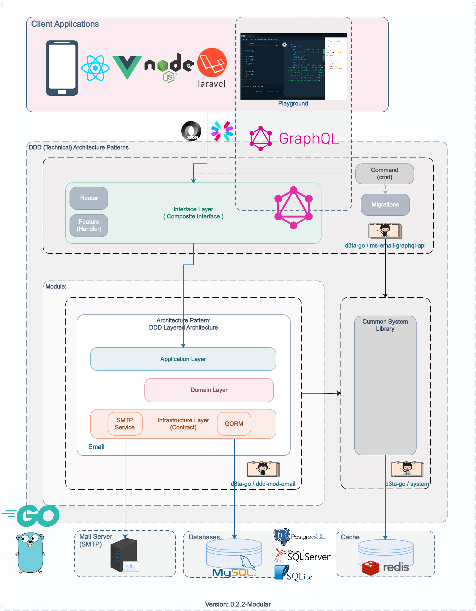
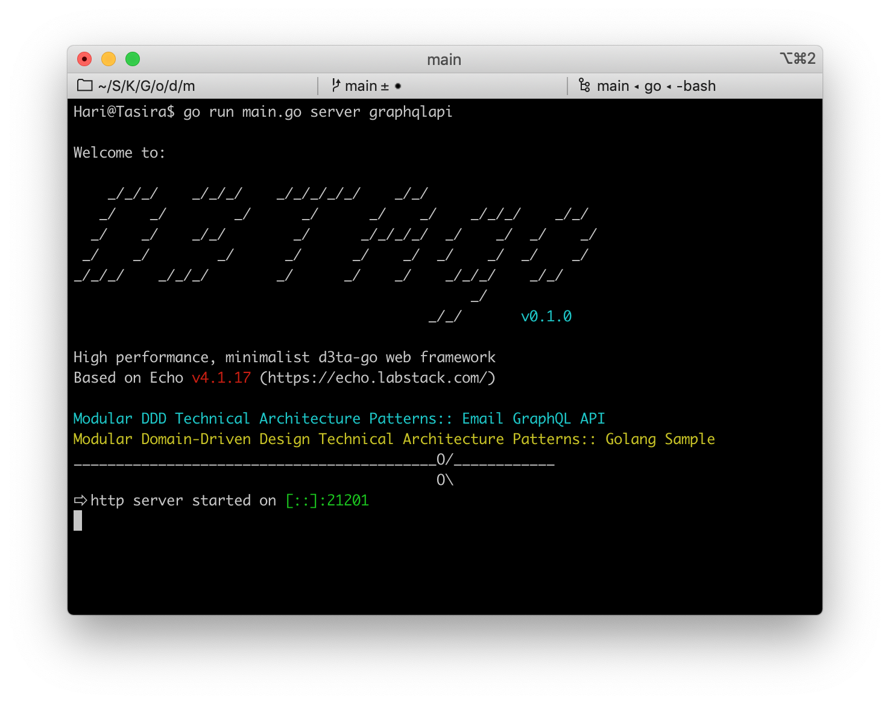
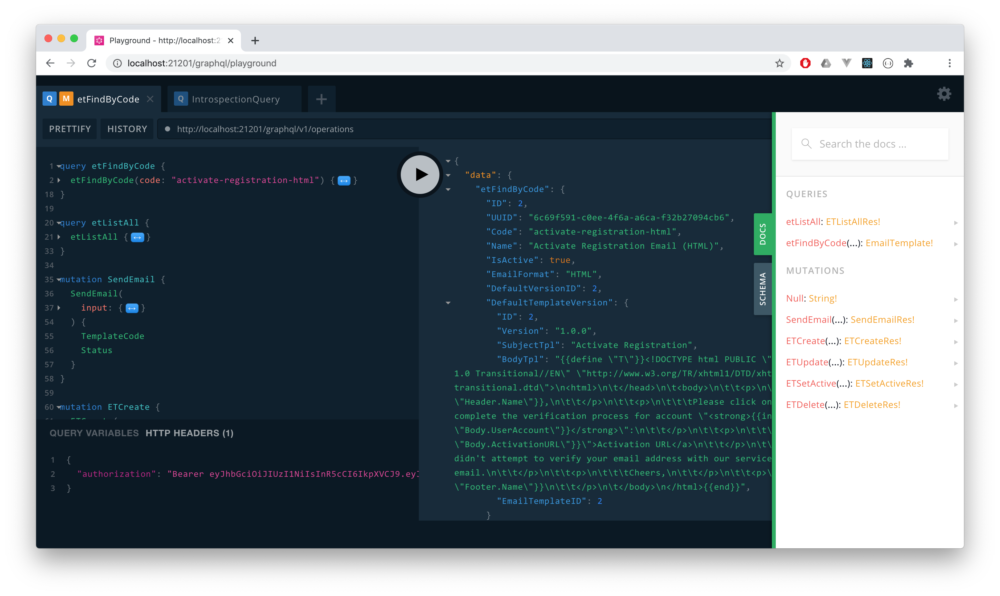

# ms-email-graphql-api ( [](https://goreportcard.com/report/github.com/d3ta-go/ms-email-graphql-api) )

MicroService Interface/Presentation App: Email GraphQL API

As a part of `Simple Implementation of Modular DDD Technical Architecture Patterns in Go`.

## Diagram v 0.2.2-Modular



## Components

A. Interface Layer (MicroService)

1. Microservice: Email GraphQL API [ [d3ta-go/ms-email-graphql-api](https://github.com/d3ta-go/ms-email-graphql-api) ]

B. DDD Modules:

1. Email - using DDD Layered Architecture (Contract, GORM, SMTP) [ [d3ta-go/ddd-mod-email](https://github.com/d3ta-go/ddd-mod-email) ]

C. Common System Libraries [ [d3ta-go/system](https://github.com/d3ta-go/system) ]:

1. Configuration - using yaml
2. Identity & Securities - using JWT, Casbin (RBAC)
3. Initializer
4. Email Sender - using SMTP
5. Handler
6. Migrations
7. Utils

D. Databases

1. MySQL (tested)
2. PostgreSQL (untested)
3. SQLServer (untested)
4. SQLite3 (untested)

E. Persistent Caches

1. Session/Token/JWT Cache (Redis, File, DB, etc) [tested: Redis]

F. Messaging [to-do]

G. Logs [to-do]

### Development

1. Clone

```shell
$ git clone https://github.com/d3ta-go/ms-email-graphql-api.git
```

2. Setup

```
a. copy `conf/config-sample.yaml` to `conf/config.yaml`
b. copy `conf/data/test-data-sample.yaml` to `conf/data/test-data.yaml`
c. setup your dependencies/requirements (e.g: database, redis, smtp, etc.)
```

3. Runing on Development Stage

```shell
$ cd ms-email-graphql-api
$ go run main.go db migrate
$ go run main.go server graphqlapi
```

4. Build

```shell
$ cd ms-email-graphql-api
$ go build
$ ./ms-email-graphql-api db migrate
$ ./ms-email-graphql-api server graphqlapi
```

5. Distribution (binary)

Binary distribution (OS-arch):

- darwin-amd64
- linux-amd64
- linux-386
- windows-amd64
- windows-386

```shell
$ cd ms-email-graphql-api
$ sh build.dist.sh
$ cd dist/[OS-arch]/
$ ./ms-email-graphql-api db migrate
$ ./ms-email-graphql-api server graphqlapi
```

**GraphQL API (console):**



**GraphQL Playground (graphql schema docs):**

URL: http://localhost:21201/graphql/playground



**Related Domain/Repositories:**

1. DDD Module: Email (Generic Subdomain) - [d3ta-go/ddd-mod-email](https://github.com/d3ta-go/ddd-mod-email)
2. Common System Libraries - [d3ta-go/system](https://github.com/d3ta-go/system)
3. Need JWT Authorization/Token from: Account (Generic Subdomain) Module/Account REST API - [d3ta-go/ms-account-restapi](https://github.com/d3ta-go/ms-account-restapi). `Please use shared redis server to store/retrieve JWT Token.`

**Online Demo:\***

> URL: **https://ms-email-graphql-d3tago-demo.mhs.web.id/graphql/playground**

For demo user account please grab it via: [**d3ta-go/ms-account-restapi**](https://github.com/d3ta-go/ms-account-restapi)

**References:**

1. [Book] Domain-Driven Design: Tackling Complexity in the Heart of Software 1st Edition (Eric Evans, 2004)

2. [Book] Patterns, Principles, and Practices of Domain-Driven Design (Scott Millett & Nick Tune, 2015)

**Team & Maintainer:**

1. Muhammad Hari (https://www.linkedin.com/in/muharihar/)
